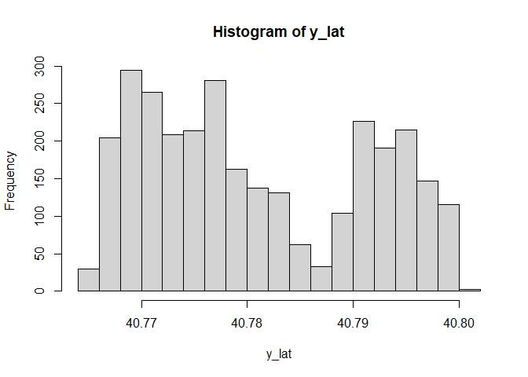
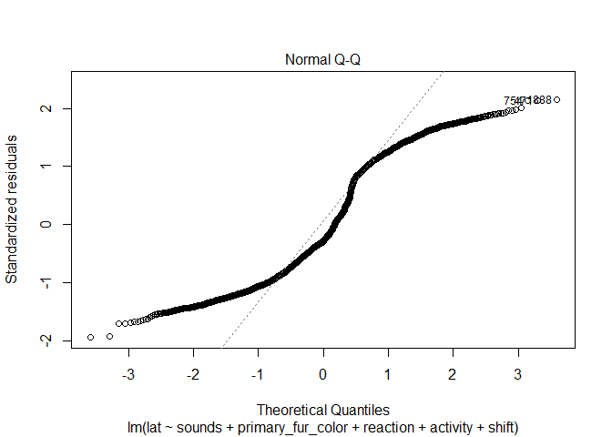

function
================

``` r
library(faraway)
library(tidyverse)
library(dplyr)
library(broom)
library(glmnet)
library(olsrr)
library(MASS)
library(caret)
library(modelr)

options(digits = 7)
```

This will be model building procedure…

``` r
sq_df = read_csv('squirrel_tidy.csv') %>% 
  janitor::clean_names()
```

    ## New names:
    ## Rows: 3023 Columns: 17
    ## ── Column specification
    ## ──────────────────────────────────────────────────────── Delimiter: "," chr
    ## (5): unique_squirrel_id, hectare, highlight_fur_color, combination_of_... dbl
    ## (11): ...1, shift, hectare_squirrel_number, age, primary_fur_color, loc... date
    ## (1): date
    ## ℹ Use `spec()` to retrieve the full column specification for this data. ℹ
    ## Specify the column types or set `show_col_types = FALSE` to quiet this message.
    ## • `` -> `...1`

``` r
# longitudinal/latitudinal function
# raw data input (no hectare information because the user would not know the info. about it)
long_model =
  lm(long ~ shift + age + primary_fur_color + location + activity + reaction + sounds, data = sq_df)
summary(long_model)
```

    ## 
    ## Call:
    ## lm(formula = long ~ shift + age + primary_fur_color + location + 
    ##     activity + reaction + sounds, data = sq_df)
    ## 
    ## Residuals:
    ##       Min        1Q    Median        3Q       Max 
    ## -0.015965 -0.005875 -0.001331  0.006604  0.019146 
    ## 
    ## Coefficients:
    ##                     Estimate Std. Error    t value Pr(>|t|)    
    ## (Intercept)       -7.397e+01  8.390e-04 -88161.363  < 2e-16 ***
    ## shift              5.763e-04  2.831e-04      2.036  0.04187 *  
    ## age               -9.137e-04  3.676e-04     -2.486  0.01299 *  
    ## primary_fur_color -5.253e-04  2.797e-04     -1.878  0.06053 .  
    ## location           1.836e-04  3.008e-04      0.610  0.54165    
    ## activity          -2.371e-04  1.054e-04     -2.250  0.02454 *  
    ## reaction           5.130e-04  1.691e-04      3.034  0.00243 ** 
    ## sounds             2.081e-03  4.895e-04      4.251 2.19e-05 ***
    ## ---
    ## Signif. codes:  0 '***' 0.001 '**' 0.01 '*' 0.05 '.' 0.1 ' ' 1
    ## 
    ## Residual standard error: 0.007675 on 3015 degrees of freedom
    ## Multiple R-squared:  0.01547,    Adjusted R-squared:  0.01319 
    ## F-statistic: 6.768 on 7 and 3015 DF,  p-value: 5.462e-08

``` r
print(long_model)
```

    ## 
    ## Call:
    ## lm(formula = long ~ shift + age + primary_fur_color + location + 
    ##     activity + reaction + sounds, data = sq_df)
    ## 
    ## Coefficients:
    ##       (Intercept)              shift                age  primary_fur_color  
    ##        -7.397e+01          5.763e-04         -9.137e-04         -5.253e-04  
    ##          location           activity           reaction             sounds  
    ##         1.836e-04         -2.371e-04          5.130e-04          2.081e-03

``` r
lat_model =
  lm(lat ~ shift + age + primary_fur_color + location + activity + reaction + sounds, data = sq_df)
summary(lat_model)
```

    ## 
    ## Call:
    ## lm(formula = lat ~ shift + age + primary_fur_color + location + 
    ##     activity + reaction + sounds, data = sq_df)
    ## 
    ## Residuals:
    ##       Min        1Q    Median        3Q       Max 
    ## -0.019660 -0.008937 -0.002902  0.010291  0.021841 
    ## 
    ## Coefficients:
    ##                     Estimate Std. Error   t value Pr(>|t|)    
    ## (Intercept)        4.078e+01  1.116e-03 36541.411  < 2e-16 ***
    ## shift              6.023e-04  3.766e-04     1.599 0.109878    
    ## age               -7.666e-04  4.890e-04    -1.568 0.117052    
    ## primary_fur_color -1.260e-03  3.721e-04    -3.385 0.000721 ***
    ## location          -8.062e-05  4.001e-04    -0.201 0.840342    
    ## activity          -2.279e-04  1.402e-04    -1.626 0.104045    
    ## reaction           7.655e-04  2.249e-04     3.404 0.000673 ***
    ## sounds             2.934e-03  6.512e-04     4.505 6.88e-06 ***
    ## ---
    ## Signif. codes:  0 '***' 0.001 '**' 0.01 '*' 0.05 '.' 0.1 ' ' 1
    ## 
    ## Residual standard error: 0.01021 on 3015 degrees of freedom
    ## Multiple R-squared:  0.01692,    Adjusted R-squared:  0.01464 
    ## F-statistic: 7.413 on 7 and 3015 DF,  p-value: 7.361e-09

``` r
print(lat_model)
```

    ## 
    ## Call:
    ## lm(formula = lat ~ shift + age + primary_fur_color + location + 
    ##     activity + reaction + sounds, data = sq_df)
    ## 
    ## Coefficients:
    ##       (Intercept)              shift                age  primary_fur_color  
    ##         4.078e+01          6.023e-04         -7.666e-04         -1.260e-03  
    ##          location           activity           reaction             sounds  
    ##        -8.062e-05         -2.279e-04          7.655e-04          2.934e-03

``` r
# model selection using p-value
long_model1 = 
  lm(long ~ shift + age + activity + reaction + sounds, data = sq_df)
summary(long_model1)
```

    ## 
    ## Call:
    ## lm(formula = long ~ shift + age + activity + reaction + sounds, 
    ##     data = sq_df)
    ## 
    ## Residuals:
    ##       Min        1Q    Median        3Q       Max 
    ## -0.015899 -0.005878 -0.001336  0.006651  0.018671 
    ## 
    ## Coefficients:
    ##               Estimate Std. Error    t value Pr(>|t|)    
    ## (Intercept) -7.397e+01  6.978e-04 -1.060e+05  < 2e-16 ***
    ## shift        5.639e-04  2.817e-04  2.001e+00  0.04543 *  
    ## age         -9.412e-04  3.663e-04 -2.569e+00  0.01024 *  
    ## activity    -2.267e-04  1.031e-04 -2.200e+00  0.02787 *  
    ## reaction     4.809e-04  1.681e-04  2.862e+00  0.00424 ** 
    ## sounds       2.142e-03  4.873e-04  4.396e+00 1.14e-05 ***
    ## ---
    ## Signif. codes:  0 '***' 0.001 '**' 0.01 '*' 0.05 '.' 0.1 ' ' 1
    ## 
    ## Residual standard error: 0.007678 on 3017 degrees of freedom
    ## Multiple R-squared:  0.01419,    Adjusted R-squared:  0.01255 
    ## F-statistic: 8.684 on 5 and 3017 DF,  p-value: 3.478e-08

``` r
print(long_model1)
```

    ## 
    ## Call:
    ## lm(formula = long ~ shift + age + activity + reaction + sounds, 
    ##     data = sq_df)
    ## 
    ## Coefficients:
    ## (Intercept)        shift          age     activity     reaction       sounds  
    ##  -7.397e+01    5.639e-04   -9.412e-04   -2.267e-04    4.809e-04    2.142e-03

``` r
lat_model1 =
  lm(lat ~ primary_fur_color + reaction + sounds, data = sq_df)
summary(lat_model1)
```

    ## 
    ## Call:
    ## lm(formula = lat ~ primary_fur_color + reaction + sounds, data = sq_df)
    ## 
    ## Residuals:
    ##       Min        1Q    Median        3Q       Max 
    ## -0.019726 -0.009004 -0.002850  0.010370  0.021857 
    ## 
    ## Coefficients:
    ##                     Estimate Std. Error   t value Pr(>|t|)    
    ## (Intercept)       40.7814005  0.0005212 78244.152  < 2e-16 ***
    ## primary_fur_color -0.0013140  0.0003716    -3.536 0.000412 ***
    ## reaction           0.0007784  0.0002234     3.484 0.000501 ***
    ## sounds             0.0029072  0.0006480     4.486 7.51e-06 ***
    ## ---
    ## Signif. codes:  0 '***' 0.001 '**' 0.01 '*' 0.05 '.' 0.1 ' ' 1
    ## 
    ## Residual standard error: 0.01022 on 3019 degrees of freedom
    ## Multiple R-squared:  0.01405,    Adjusted R-squared:  0.01307 
    ## F-statistic: 14.34 on 3 and 3019 DF,  p-value: 2.813e-09

``` r
print(lat_model1)
```

    ## 
    ## Call:
    ## lm(formula = lat ~ primary_fur_color + reaction + sounds, data = sq_df)
    ## 
    ## Coefficients:
    ##       (Intercept)  primary_fur_color           reaction             sounds  
    ##        40.7814005         -0.0013140          0.0007784          0.0029072

``` r
# model selection using automatic procedure (forward/backward)
model_stepwise_long <- lm(long ~ shift + age + primary_fur_color + location + activity + reaction + sounds, data = sq_df)
ols_step_both_p(model_stepwise_long)
```

    ## 
    ##                                    Stepwise Selection Summary                                     
    ## -------------------------------------------------------------------------------------------------
    ##                               Added/                   Adj.                                          
    ## Step        Variable         Removed     R-Square    R-Square     C(p)          AIC         RMSE     
    ## -------------------------------------------------------------------------------------------------
    ##    1         sounds          addition       0.006       0.006    25.1010    -20836.6444    0.0077    
    ##    2        reaction         addition       0.009       0.008    18.6660    -20843.0326    0.0077    
    ##    3           age           addition       0.011       0.010    13.3070    -20848.3696    0.0077    
    ##    4        activity         addition       0.013       0.012     9.9410    -20851.7308    0.0077    
    ##    5          shift          addition       0.014       0.013     7.9330    -20853.7419    0.0077    
    ##    6    primary_fur_color    addition       0.015       0.013     6.3730    -20855.3088    0.0077    
    ## -------------------------------------------------------------------------------------------------

``` r
model_stepwise_lat <- lm(lat ~ shift + age + primary_fur_color + location + activity + reaction + sounds, data = sq_df)
ols_step_both_p(model_stepwise_lat)
```

    ## 
    ##                                    Stepwise Selection Summary                                     
    ## -------------------------------------------------------------------------------------------------
    ##                               Added/                   Adj.                                          
    ## Step        Variable         Removed     R-Square    R-Square     C(p)          AIC         RMSE     
    ## -------------------------------------------------------------------------------------------------
    ##    1         sounds          addition       0.007       0.006    27.7780    -19108.7958    0.0103    
    ##    2    primary_fur_color    addition       0.010       0.009    18.9560    -19117.5522    0.0102    
    ##    3        reaction         addition       0.014       0.013     8.7970    -19127.6836    0.0102    
    ##    4        activity         addition       0.015       0.014     7.3460    -19129.1353    0.0102    
    ##    5          shift          addition       0.016       0.014     6.5490    -19129.9364    0.0102    
    ## -------------------------------------------------------------------------------------------------

``` r
# model selection using criterion-based procedure
model_criterion_long = lm(long ~ shift + age + primary_fur_color + location + activity + reaction + sounds, data = sq_df)
ols_step_best_subset(model_criterion_long)
```

    ##                           Best Subsets Regression                           
    ## ----------------------------------------------------------------------------
    ## Model Index    Predictors
    ## ----------------------------------------------------------------------------
    ##      1         sounds                                                        
    ##      2         reaction sounds                                               
    ##      3         age reaction sounds                                           
    ##      4         age activity reaction sounds                                  
    ##      5         shift age activity reaction sounds                            
    ##      6         shift age primary_fur_color activity reaction sounds          
    ##      7         shift age primary_fur_color location activity reaction sounds 
    ## ----------------------------------------------------------------------------
    ## 
    ##                                                        Subsets Regression Summary                                                       
    ## ----------------------------------------------------------------------------------------------------------------------------------------
    ##                        Adj.        Pred                                                                                                  
    ## Model    R-Square    R-Square    R-Square     C(p)          AIC           SBIC            SBC         MSEP      FPE      HSP       APC  
    ## ----------------------------------------------------------------------------------------------------------------------------------------
    ##   1        0.0060      0.0056      0.0047    25.1007    -20836.6444    -29415.5745    -20818.6023    0.1794    1e-04    0.0000    0.9953 
    ##   2        0.0087      0.0081      0.0068    18.6656    -20843.0326    -29421.9600    -20818.9766    0.1790    1e-04    0.0000    0.9932 
    ##   3        0.0111      0.0101      0.0085    13.3068    -20848.3696    -29427.2860    -20818.2995    0.1786    1e-04    0.0000    0.9915 
    ##   4        0.0129      0.0116      0.0096     9.9410    -20851.7308    -29430.6329    -20815.6467    0.1784    1e-04    0.0000    0.9904 
    ##   5        0.0142      0.0126      0.0103     7.9325    -20853.7419    -29432.6281    -20811.6439    0.1782    1e-04    0.0000    0.9897 
    ##   6        0.0153      0.0134      0.0108     6.3726    -20855.3088    -29434.1758    -20807.1967    0.1780    1e-04    0.0000    0.9892 
    ##   7        0.0155      0.0132      0.0103     8.0000    -20853.6823    -29432.5423    -20799.5563    0.1781    1e-04    0.0000    0.9898 
    ## ----------------------------------------------------------------------------------------------------------------------------------------
    ## AIC: Akaike Information Criteria 
    ##  SBIC: Sawa's Bayesian Information Criteria 
    ##  SBC: Schwarz Bayesian Criteria 
    ##  MSEP: Estimated error of prediction, assuming multivariate normality 
    ##  FPE: Final Prediction Error 
    ##  HSP: Hocking's Sp 
    ##  APC: Amemiya Prediction Criteria

``` r
model_criterion_lat <- lm(lat ~ shift + age + primary_fur_color + location + activity + reaction + sounds, data = sq_df)
ols_step_best_subset(model_criterion_lat)
```

    ##                           Best Subsets Regression                           
    ## ----------------------------------------------------------------------------
    ## Model Index    Predictors
    ## ----------------------------------------------------------------------------
    ##      1         sounds                                                        
    ##      2         primary_fur_color sounds                                      
    ##      3         primary_fur_color reaction sounds                             
    ##      4         primary_fur_color activity reaction sounds                    
    ##      5         shift primary_fur_color activity reaction sounds              
    ##      6         shift age primary_fur_color activity reaction sounds          
    ##      7         shift age primary_fur_color location activity reaction sounds 
    ## ----------------------------------------------------------------------------
    ## 
    ##                                                        Subsets Regression Summary                                                       
    ## ----------------------------------------------------------------------------------------------------------------------------------------
    ##                        Adj.        Pred                                                                                                  
    ## Model    R-Square    R-Square    R-Square     C(p)          AIC           SBIC            SBC         MSEP      FPE      HSP       APC  
    ## ----------------------------------------------------------------------------------------------------------------------------------------
    ##   1        0.0066      0.0062      0.0053    27.7776    -19108.7958    -27687.7295    -19090.7538    0.3178    1e-04    0.0000    0.9948 
    ##   2        0.0101      0.0094      0.0081    18.9558    -19117.5522    -27696.4802    -19093.4962    0.3168    1e-04    0.0000    0.9919 
    ##   3        0.0141      0.0131      0.0114     8.7968    -19127.6836    -27706.5881    -19097.6136    0.3156    1e-04    0.0000    0.9886 
    ##   4        0.0152      0.0139      0.0119     7.3462    -19129.1353    -27708.0289    -19093.0513    0.3154    1e-04    0.0000    0.9881 
    ##   5        0.0161      0.0145      0.0122     6.5488    -19129.9364    -27708.8171    -19087.8384    0.3152    1e-04    0.0000    0.9878 
    ##   6        0.0169      0.0149      0.0124     6.0406    -19130.4502    -27709.3157    -19082.3382    0.3150    1e-04    0.0000    0.9877 
    ##   7        0.0169      0.0146      0.0118     8.0000    -19128.4909    -27707.3509    -19074.3649    0.3151    1e-04    0.0000    0.9883 
    ## ----------------------------------------------------------------------------------------------------------------------------------------
    ## AIC: Akaike Information Criteria 
    ##  SBIC: Sawa's Bayesian Information Criteria 
    ##  SBC: Schwarz Bayesian Criteria 
    ##  MSEP: Estimated error of prediction, assuming multivariate normality 
    ##  FPE: Final Prediction Error 
    ##  HSP: Hocking's Sp 
    ##  APC: Amemiya Prediction Criteria

``` r
# model selection using LASSO procedure: longitude
y_long <- sq_df$long
hist(y_long)
```

<!-- -->

``` r
x <- sq_df %>% 
  dplyr::select(
    shift, age, primary_fur_color,location, activity, reaction, sounds
    ) %>%
  data.matrix()

set.seed(2022)
cv_model_long <- cv.glmnet(x,y_long, alpha = 1)
(best_lambda_long <- cv_model_long$lambda.min)
```

    ## [1] 2.246901e-06

``` r
long_lasso <- glmnet(x, y_long, alpha = 1, lambda = best_lambda_long)
coef(long_lasso)
```

    ## 8 x 1 sparse Matrix of class "dgCMatrix"
    ##                              s0
    ## (Intercept)       -7.396680e+01
    ## shift              5.713470e-04
    ## age               -9.081172e-04
    ## primary_fur_color -5.210497e-04
    ## location           1.768355e-04
    ## activity          -2.351475e-04
    ## reaction           5.096738e-04
    ## sounds             2.073993e-03

``` r
# model selection using LASSO procedure: latitude
y_lat <- sq_df$lat
hist(y_lat)
```

<!-- -->

``` r
x <- sq_df %>% 
  dplyr::select(
    shift, age, primary_fur_color,location, activity, reaction, sounds
    ) %>%
  data.matrix()

set.seed(2023)
cv_model_lat <- cv.glmnet(x,y_lat, alpha = 1)
(best_lambda_lat <- cv_model_lat$lambda.min)
```

    ## [1] 6.154509e-05

``` r
lat_lasso <- glmnet(x, y_lat, alpha = 1, lambda = best_lambda_lat)
coef(lat_lasso)
```

    ## 8 x 1 sparse Matrix of class "dgCMatrix"
    ##                              s0
    ## (Intercept)       40.7816933208
    ## shift              0.0004907211
    ## age               -0.0006332138
    ## primary_fur_color -0.0011405094
    ## location           .           
    ## activity          -0.0001948355
    ## reaction           0.0006874044
    ## sounds             0.0027034309

``` r
# model comparisons for long
long_model2 = 
  lm(long ~ sounds + reaction + age + activity + shift + primary_fur_color, data = sq_df)
summary(long_model1)
```

    ## 
    ## Call:
    ## lm(formula = long ~ shift + age + activity + reaction + sounds, 
    ##     data = sq_df)
    ## 
    ## Residuals:
    ##       Min        1Q    Median        3Q       Max 
    ## -0.015899 -0.005878 -0.001336  0.006651  0.018671 
    ## 
    ## Coefficients:
    ##               Estimate Std. Error    t value Pr(>|t|)    
    ## (Intercept) -7.397e+01  6.978e-04 -1.060e+05  < 2e-16 ***
    ## shift        5.639e-04  2.817e-04  2.001e+00  0.04543 *  
    ## age         -9.412e-04  3.663e-04 -2.569e+00  0.01024 *  
    ## activity    -2.267e-04  1.031e-04 -2.200e+00  0.02787 *  
    ## reaction     4.809e-04  1.681e-04  2.862e+00  0.00424 ** 
    ## sounds       2.142e-03  4.873e-04  4.396e+00 1.14e-05 ***
    ## ---
    ## Signif. codes:  0 '***' 0.001 '**' 0.01 '*' 0.05 '.' 0.1 ' ' 1
    ## 
    ## Residual standard error: 0.007678 on 3017 degrees of freedom
    ## Multiple R-squared:  0.01419,    Adjusted R-squared:  0.01255 
    ## F-statistic: 8.684 on 5 and 3017 DF,  p-value: 3.478e-08

``` r
summary(long_model2)
```

    ## 
    ## Call:
    ## lm(formula = long ~ sounds + reaction + age + activity + shift + 
    ##     primary_fur_color, data = sq_df)
    ## 
    ## Residuals:
    ##       Min        1Q    Median        3Q       Max 
    ## -0.016016 -0.005863 -0.001302  0.006615  0.019090 
    ## 
    ## Coefficients:
    ##                     Estimate Std. Error    t value Pr(>|t|)    
    ## (Intercept)       -7.397e+01  7.571e-04 -97703.566  < 2e-16 ***
    ## sounds             2.109e-03  4.874e-04      4.326 1.56e-05 ***
    ## reaction           5.043e-04  1.684e-04      2.994  0.00278 ** 
    ## age               -8.995e-04  3.668e-04     -2.452  0.01426 *  
    ## activity          -2.236e-04  1.030e-04     -2.170  0.03007 *  
    ## shift              5.588e-04  2.816e-04      1.984  0.04731 *  
    ## primary_fur_color -5.278e-04  2.797e-04     -1.887  0.05926 .  
    ## ---
    ## Signif. codes:  0 '***' 0.001 '**' 0.01 '*' 0.05 '.' 0.1 ' ' 1
    ## 
    ## Residual standard error: 0.007674 on 3016 degrees of freedom
    ## Multiple R-squared:  0.01535,    Adjusted R-squared:  0.01339 
    ## F-statistic: 7.836 on 6 and 3016 DF,  p-value: 2.164e-08

``` r
# model comparisons for lat
lat_model2 = 
  lm(lat ~ sounds + primary_fur_color + reaction + activity + shift, data = sq_df)
lat_model3 = 
  lm(lat ~ sounds + reaction + age + activity + shift + primary_fur_color, data = sq_df)
summary(lat_model1)
```

    ## 
    ## Call:
    ## lm(formula = lat ~ primary_fur_color + reaction + sounds, data = sq_df)
    ## 
    ## Residuals:
    ##       Min        1Q    Median        3Q       Max 
    ## -0.019726 -0.009004 -0.002850  0.010370  0.021857 
    ## 
    ## Coefficients:
    ##                     Estimate Std. Error   t value Pr(>|t|)    
    ## (Intercept)       40.7814005  0.0005212 78244.152  < 2e-16 ***
    ## primary_fur_color -0.0013140  0.0003716    -3.536 0.000412 ***
    ## reaction           0.0007784  0.0002234     3.484 0.000501 ***
    ## sounds             0.0029072  0.0006480     4.486 7.51e-06 ***
    ## ---
    ## Signif. codes:  0 '***' 0.001 '**' 0.01 '*' 0.05 '.' 0.1 ' ' 1
    ## 
    ## Residual standard error: 0.01022 on 3019 degrees of freedom
    ## Multiple R-squared:  0.01405,    Adjusted R-squared:  0.01307 
    ## F-statistic: 14.34 on 3 and 3019 DF,  p-value: 2.813e-09

``` r
summary(lat_model2)
```

    ## 
    ## Call:
    ## lm(formula = lat ~ sounds + primary_fur_color + reaction + activity + 
    ##     shift, data = sq_df)
    ## 
    ## Residuals:
    ##       Min        1Q    Median        3Q       Max 
    ## -0.019713 -0.008909 -0.002889  0.010318  0.021904 
    ## 
    ## Coefficients:
    ##                     Estimate Std. Error   t value Pr(>|t|)    
    ## (Intercept)       40.7810047  0.0008763 46538.475  < 2e-16 ***
    ## sounds             0.0029603  0.0006480     4.568 5.11e-06 ***
    ## primary_fur_color -0.0012940  0.0003714    -3.484 0.000501 ***
    ## reaction           0.0007625  0.0002241     3.403 0.000674 ***
    ## activity          -0.0002411  0.0001370    -1.760 0.078586 .  
    ## shift              0.0006264  0.0003746     1.672 0.094556 .  
    ## ---
    ## Signif. codes:  0 '***' 0.001 '**' 0.01 '*' 0.05 '.' 0.1 ' ' 1
    ## 
    ## Residual standard error: 0.01021 on 3017 degrees of freedom
    ## Multiple R-squared:  0.01609,    Adjusted R-squared:  0.01446 
    ## F-statistic: 9.866 on 5 and 3017 DF,  p-value: 2.266e-09

``` r
summary(lat_model3)
```

    ## 
    ## Call:
    ## lm(formula = lat ~ sounds + reaction + age + activity + shift + 
    ##     primary_fur_color, data = sq_df)
    ## 
    ## Residuals:
    ##       Min        1Q    Median        3Q       Max 
    ## -0.019694 -0.008938 -0.002912  0.010297  0.021788 
    ## 
    ## Coefficients:
    ##                     Estimate Std. Error   t value Pr(>|t|)    
    ## (Intercept)       40.7817911  0.0010070 40498.748  < 2e-16 ***
    ## sounds             0.0029217  0.0006483     4.507 6.83e-06 ***
    ## reaction           0.0007693  0.0002240     3.434 0.000604 ***
    ## age               -0.0007729  0.0004879    -1.584 0.113299    
    ## activity          -0.0002339  0.0001370    -1.706 0.088025 .  
    ## shift              0.0006100  0.0003746     1.628 0.103575    
    ## primary_fur_color -0.0012585  0.0003720    -3.383 0.000727 ***
    ## ---
    ## Signif. codes:  0 '***' 0.001 '**' 0.01 '*' 0.05 '.' 0.1 ' ' 1
    ## 
    ## Residual standard error: 0.01021 on 3016 degrees of freedom
    ## Multiple R-squared:  0.01691,    Adjusted R-squared:  0.01495 
    ## F-statistic: 8.644 on 6 and 3016 DF,  p-value: 2.397e-09

``` r
set.seed(1)
# Use 10-fold validation 
train = trainControl(method = "cv", number = 10)
y1 <- data.frame(cbind(sq_df$long, sq_df$lat))
model_caret1 = train(long ~ primary_fur_color + reaction + sounds, data = sq_df,
trControl = train,
method = 'lm',
na.action = na.pass)

# fitting a regression line
model_caret1$finalModel
```

    ## 
    ## Call:
    ## lm(formula = .outcome ~ ., data = dat)
    ## 
    ## Coefficients:
    ##       (Intercept)  primary_fur_color           reaction             sounds  
    ##        -7.397e+01         -5.880e-04          5.122e-04          2.103e-03

``` r
model_caret1
```

    ## Linear Regression 
    ## 
    ## 3023 samples
    ##    3 predictor
    ## 
    ## No pre-processing
    ## Resampling: Cross-Validated (10 fold) 
    ## Summary of sample sizes: 2721, 2721, 2721, 2720, 2720, 2720, ... 
    ## Resampling results:
    ## 
    ##   RMSE         Rsquared    MAE        
    ##   0.007690637  0.01094338  0.006537054
    ## 
    ## Tuning parameter 'intercept' was held constant at a value of TRUE

``` r
model_caret2 = train(lat ~ primary_fur_color + reaction + sounds, data = sq_df,
trControl = train,
method = 'lm',
na.action = na.pass)

# fitting a regression line
model_caret2$finalModel
```

    ## 
    ## Call:
    ## lm(formula = .outcome ~ ., data = dat)
    ## 
    ## Coefficients:
    ##       (Intercept)  primary_fur_color           reaction             sounds  
    ##        40.7814005         -0.0013140          0.0007784          0.0029072

``` r
model_caret2
```

    ## Linear Regression 
    ## 
    ## 3023 samples
    ##    3 predictor
    ## 
    ## No pre-processing
    ## Resampling: Cross-Validated (10 fold) 
    ## Summary of sample sizes: 2720, 2720, 2720, 2721, 2722, 2720, ... 
    ## Resampling results:
    ## 
    ##   RMSE        Rsquared    MAE        
    ##   0.01022068  0.01539182  0.009042755
    ## 
    ## Tuning parameter 'intercept' was held constant at a value of TRUE

# latitudinal model selection

``` r
# latitudinal data function
lat_model =
  lm(lat ~ hectare_squirrel_number + primary_fur_color + location + activity + reaction + sounds, data = sq_df)
summary(lat_model)
```

    ## 
    ## Call:
    ## lm(formula = lat ~ hectare_squirrel_number + primary_fur_color + 
    ##     location + activity + reaction + sounds, data = sq_df)
    ## 
    ## Residuals:
    ##       Min        1Q    Median        3Q       Max 
    ## -0.019948 -0.008798 -0.002505  0.010204  0.022433 
    ## 
    ## Coefficients:
    ##                           Estimate Std. Error   t value Pr(>|t|)    
    ## (Intercept)              4.078e+01  8.031e-04 50780.935  < 2e-16 ***
    ## hectare_squirrel_number -4.034e-04  5.971e-05    -6.756 1.70e-11 ***
    ## primary_fur_color       -1.215e-03  3.691e-04    -3.292  0.00101 ** 
    ## location                -3.407e-04  3.952e-04    -0.862  0.38871    
    ## activity                -2.335e-04  1.391e-04    -1.678  0.09343 .  
    ## reaction                 7.289e-04  2.230e-04     3.268  0.00109 ** 
    ## sounds                   3.049e-03  6.462e-04     4.718 2.49e-06 ***
    ## ---
    ## Signif. codes:  0 '***' 0.001 '**' 0.01 '*' 0.05 '.' 0.1 ' ' 1
    ## 
    ## Residual standard error: 0.01014 on 3016 degrees of freedom
    ## Multiple R-squared:  0.02993,    Adjusted R-squared:  0.028 
    ## F-statistic: 15.51 on 6 and 3016 DF,  p-value: < 2.2e-16

pvalue_fit_lat = lm(lat \~ primary_fur_color + reaction + sounds, data =
sq_df) pvalue_adjrsquared_lat \<- summary(pvalue_fit_lat)\$adj.r.squared

auto_fit_lat = lm(lat \~ sounds + primary_fur_color + reaction +
activity + shift ,data = sq_df) auto_adjrsquared_lat \<-
summary(auto_fit_lat)\$adj.r.squared

crit_fit_lat = lm(lat \~ shift + age + primary_fur_color + activity +
reaction + sounds, data = sq_df) crit_adjrsquared_lat \<-
summary(crit_fit_lat)\$adj.r.squared

lasso_fit_lat = lm(lat \~ shift + age + primary_fur_color + activity +
reaction + sounds, data = sq_df)

``` r
# all latitude models
pvalue_fit_lat = lm(lat ~ primary_fur_color + reaction + sounds, data = sq_df)
pvalue_adjrsquared_lat <- summary(pvalue_fit_lat)$adj.r.squared

auto_fit_lat = lm(lat ~ sounds + primary_fur_color + reaction + activity + shift ,data = sq_df)
auto_adjrsquared_lat <- summary(auto_fit_lat)$adj.r.squared

crit_fit_lat = lm(lat ~ shift + age + primary_fur_color + activity +  reaction + sounds, data = sq_df)
crit_adjrsquared_lat <- summary(crit_fit_lat)$adj.r.squared

lasso_fit_lat = lm(lat ~ shift + age + primary_fur_color + activity + reaction + sounds, data = sq_df)
lasso_adjrsquared_lat <- summary(lasso_fit_lat)$adj.r.squared
```

# longitudinal model selection

model_pvalue = lm(long \~ shift + age + activity + reaction + sounds,
data = sq_df)

model_criterion = lm(cbind(long, lat) \~ shift +
hectare_squirrel_number + primary_fur_color + location + activity +
reaction + sounds, data = sq_df) ols_step_best_subset(model_criterion)

model_stepwise \<- lm(long \~ hectare_squirrel_number +
primary_fur_color + location + activity + reaction + sounds, data =
sq_df) ols_step_both_p(model_stepwise)

model_lasso = lm(long \~ shift + age + primary_fur_color + location +
activity + reaction + sounds, data = sq_df)

``` r
# all longitude models
pvalue_fit_long = lm(long ~ shift + age + activity + reaction + sounds, data = sq_df)
pvalue_adjrsquared_long <- summary(pvalue_fit_long)$adj.r.squared

auto_fit_long = lm(long ~ sounds + primary_fur_color + reaction + activity + shift ,data = sq_df)
auto_adjrsquared_long <- summary(auto_fit_long)$adj.r.squared

crit_fit_long = lm(long ~ shift + age + primary_fur_color + activity + reaction + sounds, data = sq_df)
crit_adjrsquared_long <- summary(crit_fit_long)$adj.r.squared

lasso_fit_long = lm(long ~ shift + age + primary_fur_color + location + activity + reaction + sounds, data = sq_df)
lasso_adjrsquared_long <- summary(lasso_fit_long)$adj.r.squared
```

``` r
# cross- validation
cv_df <- crossv_mc(sq_df, 100)
cv_df <- cv_df %>% 
  mutate(
    train = map(train, as_tibble),
    test = map(test, as_tibble)
  )
```

``` r
# latitudinal model selection
cv_df_lat = 
  cv_df %>% 
  mutate(
    pvalue_fit = map(train, ~lm(lat ~ primary_fur_color + reaction + sounds, data = .x)),
    auto_fit = map(train, ~lm(lat ~ sounds + primary_fur_color + reaction + activity + shift ,data = .x)),
    crit_fit = map(train, ~lm(lat ~ shift + age + primary_fur_color + activity +  reaction + sounds, data = .x)),
    lasso_fit = map(train, ~lm(lat ~ shift + age + primary_fur_color + activity + reaction + sounds, data = .x))
  ) %>%
  mutate(
    rmse_pvalue = map2_dbl(pvalue_fit, test, ~rmse(model = .x, data = .y)),
    rmse_auto = map2_dbl(auto_fit, test, ~rmse(model = .x, data = .y)),
    rmse_crit = map2_dbl(crit_fit, test, ~rmse(model = .x, data = .y)),
    rmse_lasso = map2_dbl(lasso_fit, test, ~rmse(model = .x, data = .y))
  )

# Comparing the RMSE
cv_df_lat %>% 
  dplyr::select(starts_with('rmse_')) %>% 
  map(median)
```

    ## $rmse_pvalue
    ## [1] 0.01021509
    ## 
    ## $rmse_auto
    ## [1] 0.01021608
    ## 
    ## $rmse_crit
    ## [1] 0.01020896
    ## 
    ## $rmse_lasso
    ## [1] 0.01020896

``` r
cv_df_lat %>% 
  dplyr::select(starts_with("rmse")) %>% 
  pivot_longer(
    everything(),
    names_to = "model", 
    values_to = "rmse",
    names_prefix = "rmse_") %>% 
  mutate(model = fct_inorder(model)) %>% 
  ggplot(aes(x = model, y = rmse)) + geom_violin() +
  labs(
    title = 'RMSE for Cross Validation of Latitude Models',
       x = 'models', y = 'RMSE'
  )
```

<!-- -->

``` r
cv_df_long = 
  cv_df %>% 
  mutate(
    pvalue_fit = map(train, ~lm(long ~ shift + age + activity + reaction + sounds, data = .x)),
    auto_fit = map(train, ~lm(long ~ sounds + primary_fur_color + reaction + activity + shift ,data = .x)),
    crit_fit = map(train, ~lm(long ~ shift + age + primary_fur_color + activity + reaction + sounds, data = .x)),
    lasso_fit = map(train, ~lm(long ~ shift + age + primary_fur_color + location + activity + reaction + sounds, data = .x))
  ) %>% 
  mutate(
    rmse_pvalue = map2_dbl(pvalue_fit, test, ~rmse(model = .x, data = .y)),
    rmse_auto = map2_dbl(auto_fit, test, ~rmse(model = .x, data = .y)),
    rmse_crit = map2_dbl(crit_fit, test, ~rmse(model = .x, data = .y)),
    rmse_lasso = map2_dbl(lasso_fit, test, ~rmse(model = .x, data = .y))
  )

# Comparing the RMSE
cv_df_long %>% 
  dplyr::select(starts_with('rmse_')) %>% 
  map(median)
```

    ## $rmse_pvalue
    ## [1] 0.007696558
    ## 
    ## $rmse_auto
    ## [1] 0.007692802
    ## 
    ## $rmse_crit
    ## [1] 0.007691777
    ## 
    ## $rmse_lasso
    ## [1] 0.00769105

``` r
cv_df_long %>% 
  dplyr::select(starts_with("rmse")) %>% 
  pivot_longer(
    everything(),
    names_to = "model", 
    values_to = "rmse",
    names_prefix = "rmse_") %>% 
  mutate(model = fct_inorder(model)) %>% 
  ggplot(aes(x = model, y = rmse)) + geom_violin() +
  labs(
    title = 'RMSE for Cross Validation of Longitude Models',
       x = 'models', y = 'RMSE'
  )
```

<!-- -->

latitude: automatic method is chosen due to the rule of parsimony.(only
5 predictors while LASSO and criterion-based methods have 6 predictors).
When the RMSE distributions are basically same among the methods, the
automatic method has slightly lower median both RMSE and Rsquared.

longitude: criterion based method is chosen: lowest median RMSE(since
every method’s RMSE distribution is pretty similar) and highest adjusted
R squared

``` r
# RMSE and adj Rsqured comparison table
# latitude: automatic method is chosen due to the rule of parsimony.(only 5 predictors while LASSO and criterion-based methods hava 6 predictors). When the RMSE distributions are basically same among the methods, the automatic method has slightly lower median both RMSE and Rsquared.

methods <- c('pvalue','automatic','criterion-based','LASSO')
RMSE_lat <- 
  cv_df_lat %>% 
  dplyr::select(starts_with('rmse_')) %>% 
  map(median) %>% 
  unlist()

adjrsquared_lat <- c(pvalue_adjrsquared_lat,auto_adjrsquared_lat,
                       crit_adjrsquared_lat, lasso_adjrsquared_lat)
lat_comparison <- tibble(
  methods,
  RMSE_lat, 
  adjrsquared_lat
)
lat_comparison %>% knitr::kable()
```

| methods         |  RMSE_lat | adjrsquared_lat |
|:----------------|----------:|----------------:|
| pvalue          | 0.0102151 |       0.0130708 |
| automatic       | 0.0102161 |       0.0144571 |
| criterion-based | 0.0102090 |       0.0149498 |
| LASSO           | 0.0102090 |       0.0149498 |

``` r
#longitude: criterion based method is chosen: lowest median RMSE(since evry method's RMSE distribution is pretty similar) and highest adjusted R squared
RMSE_long <- 
  cv_df_long %>% 
  dplyr::select(starts_with('rmse_')) %>% 
  map(median) %>% 
  unlist()

adjrsquared_long <- c(pvalue_adjrsquared_long,auto_adjrsquared_long,
                       crit_adjrsquared_long, lasso_adjrsquared_long)
long_comparison <- tibble(
  methods,
  RMSE_long, 
  adjrsquared_long
)
long_comparison %>% knitr::kable()
```

| methods         | RMSE_long | adjrsquared_long |
|:----------------|----------:|-----------------:|
| pvalue          | 0.0076966 |        0.0125531 |
| automatic       | 0.0076928 |        0.0117514 |
| criterion-based | 0.0076918 |        0.0133905 |
| LASSO           | 0.0076910 |        0.0131852 |

``` r
# final model
long_model_final=
  lm(long ~ shift + age + primary_fur_color + activity + reaction + sounds, data = sq_df)
print(long_model_final)
```

    ## 
    ## Call:
    ## lm(formula = long ~ shift + age + primary_fur_color + activity + 
    ##     reaction + sounds, data = sq_df)
    ## 
    ## Coefficients:
    ##       (Intercept)              shift                age  primary_fur_color  
    ##        -7.397e+01          5.588e-04         -8.995e-04         -5.278e-04  
    ##          activity           reaction             sounds  
    ##        -2.236e-04          5.043e-04          2.109e-03

``` r
lat_model_final=
  lm(lat ~ sounds + primary_fur_color + reaction + activity + shift, data = sq_df)
print(lat_model_final)
```

    ## 
    ## Call:
    ## lm(formula = lat ~ sounds + primary_fur_color + reaction + activity + 
    ##     shift, data = sq_df)
    ## 
    ## Coefficients:
    ##       (Intercept)             sounds  primary_fur_color           reaction  
    ##        40.7810047          0.0029603         -0.0012940          0.0007625  
    ##          activity              shift  
    ##        -0.0002411          0.0006264

``` r
# final model diagnostic
plot(long_model_final)
```

<!-- --><!-- --><!-- --><!-- -->

``` r
plot(lat_model_final)
```

<!-- --><!-- --><!-- --><!-- -->
