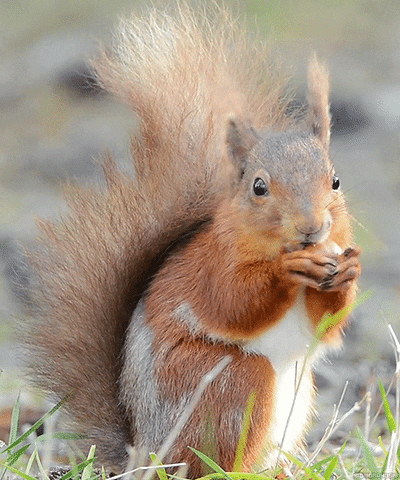

```{css, echo=FALSE}
h1{
  text-align: center;
}
```

```{r setup, include=FALSE}
knitr::opts_chunk$set(echo = TRUE)
library(leaflet)
library(tidyverse)
library(readr)
library(dplyr)
library(ggplot2)
library(scales)
library(ggthemes)
library(report)
library(sf)
library(shiny)
knitr::opts_chunk$set(
	echo = TRUE,
	warning = FALSE,
	message = FALSE, 
	fig.width = 8, 
  fig.height = 6,
  out.width = "90%"
)
theme_set(theme_minimal() + theme(legend.position = "bottom"))
options(
  ggplot2.continuous.colour = "viridis",
  ggplot2.continuous.fill = "viridis"
)

scale_colour_discrete = scale_colour_viridis_d
scale_fill_discrete = scale_fill_viridis_d

theme_set(theme_minimal() + theme(legend.position = "bottom"))
```

<script>
   $(document).ready(function() {
     $head = $('#header');
     $head.prepend('')
   });
</script>

<center>
{width=75%}
</center>

```{r,include=FALSE}
census1 = #这是数据处理过后的，即编号0，1，2，3的，原始版在下面
  read_csv("2018_Central_Park_Squirrel_Census_-_Squirrel_Data.csv")%>% 
  janitor::clean_names() %>%
  mutate(date=as.character(date),
         long = as.numeric(x),
         lat = as.numeric(y),
         shift = as.character(shift),
         primary_fur_color=as.character(primary_fur_color),
         activity = case_when( running == "TRUE" ~ "running",
                               chasing == "TRUE" ~ "chasing",
                               climbing == "TRUE" ~ "climbing",
                               eating == "TRUE" ~ "eating",
                               foraging == "TRUE" ~ "foraging"),
         reaction = case_when( approaches == "TRUE" ~ "approaches",
                               indifferent == "TRUE" ~ "indifferent",
                               runs_from == "TRUE" ~ "runs_from"),
         sounds = case_when( kuks == "TRUE" ~ "kuks",
                               quaas == "TRUE" ~ "quaas",
                               moans == "TRUE" ~ "moans"))%>%
         mutate(primary_fur_color = case_when(primary_fur_color == "Gray" ~ "1"
          ,primary_fur_color == "Cinnamon" ~ "2",
          primary_fur_color == "Black" ~ "3",
          TRUE ~ "0"
         ))%>%
  mutate(shift = case_when(shift == "AM" ~ "1"
          ,shift == "PM" ~ "2",
          TRUE ~ "0"
         ))%>%
  mutate(age = case_when(age == "Adult" ~ "1"
          ,age == "Juvenile" ~ "2",
          TRUE ~ "0"
         ))%>%
   mutate(activity = case_when(activity == "running" ~ "1"
          ,activity == "eating" ~ "2",
          activity == "foraging" ~ "3",
          activity == "climbing" ~ "4",
          activity == "chasing" ~ "5",
          TRUE ~ "0"
         ))%>%
  mutate(reaction = case_when(reaction == "indifferent" ~ "1"
          ,reaction == "runs_from" ~ "2",
          reaction == "approaches" ~ "3",
          TRUE ~ "0"
         ))%>%
  mutate(sounds = case_when(sounds == "kuks"~ "1",
                               sounds =="quaas" ~ "2",
                               sounds == "moans" ~ "3",
          TRUE ~ "0"
         ))%>%
  select(-x,-y,-running,-chasing,-climbing,-eating,-foraging,-above_ground_sighter_measurement,-color_notes,-other_activities,-specific_location ,-tail_flags ,-tail_twitches,-other_interactions,-kuks,-quaas,-moans,-approaches,-indifferent,-runs_from)
```

```{r,include=FALSE}
census = #这是未数据处理过后的，即原始版
  read_csv("2018_Central_Park_Squirrel_Census_-_Squirrel_Data.csv")%>% 
  janitor::clean_names() %>%
  mutate(date=as.character(date),
         long = as.numeric(x),
         lat = as.numeric(y),
         shift = as.character(shift),
         primary_fur_color=as.character(primary_fur_color),
         activity = case_when( running == "TRUE" ~ "running",
                               chasing == "TRUE" ~ "chasing",
                               climbing == "TRUE" ~ "climbing",
                               eating == "TRUE" ~ "eating",
                               foraging == "TRUE" ~ "foraging"),
         reaction = case_when( approaches == "TRUE" ~ "approaches",
                               indifferent == "TRUE" ~ "indifferent",
                               runs_from == "TRUE" ~ "runs_from"),
         sounds = case_when( kuks == "TRUE" ~ "kuks",
                               quaas == "TRUE" ~ "quaas",
                               moans == "TRUE" ~ "moans"))%>%
  select(-x,-y,-running,-chasing,-climbing,-eating,-foraging,-above_ground_sighter_measurement,-color_notes,-other_activities,-specific_location ,-tail_flags ,-tail_twitches,-other_interactions,-kuks,-quaas,-moans,-approaches,-indifferent,-runs_from)
```

```{r}
nyc_squirrels1=
  census%>%
  ggplot(aes(long, lat)) +
  geom_point() +
  theme_map()
nyc_squirrelmap <- leaflet(data=census1) %>%
  addTiles() %>%  
  addMarkers(lng=~long, lat=~lat, popup= ~hectare,clusterOptions = markerClusterOptions())
nyc_squirrelmap
```

### Motivation

Squirrels are everywhere, but is there a trend of where they prefer to stay with respect to their color, age, activities and all other features? Doing an analysis using squirrel census data may answer the question. Based on the results of the investigation we can compile relevant charts and make reasonable exploits, prevention or prediction based on information about squirrel habitat and activity patterns in Central Park.

<center>
{width=75%}
</center>

### Screencast

### Website Overview

Under the [squirrel map]() tab, you will find:

In the exploratory analyses section, you will find:

In the shiny section, you will find:

### Collaborators

**Yimin Chen**	  (yc4195)

**Jiong Ma**	    (jm5509)

**Feng Yan**	    (fy2297)

**Wenjing Yang**	(wy2369)

**Yang Yi**	      (yy3307)